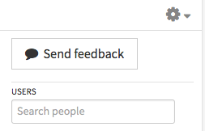

Zulip is a chat app. Its most distinctive characteristic is that conversation among a group of people can be divided according to subject "streams" and further subdivided into "topics", so much finer-grained conversations are possible than with IRC or other chat tools. 

Most people use currently Zulip on the Web. There are also versions for Android/iOS, and for Mac/Linux/Windows, as well as a cross-platform version and a version for Platform 9. See https://zulip.tabbott.net/apps for more information. 

 1. **The Zulip browser window**

    2. There are three panes in your browser window. 
    
       The middle one, the "**message table**,  is the stream of messages.
       
       To its left is the "**left sidebar**", showing "filters" or "views" for different kinds of messages, and below it a menu of streams you are subscribed to:
       
       

       On the right side of the browser window is the "**right sidebar**", showing users and some configuration settings:
       
       
    
    2. If your browser  window is narrow, you'll see only the message table, or the message table and the left sidebar but not the right sidebar. 

 1. **Posting and replying**

    At the bottom of your screen, choose whether to post to a stream or to individual users. 

    2. **Posting and replying to a stream**
    
       3. Click "New stream message" at the bottom of your screen (or select a stream from the list on the left side of your screen). 
       
       3. Enter a stream name, or the beginning of one. Private ("invite-only") streams show a lock next to the name.
       
       3. Enter a topic name — we recommend keeping them brief, and they are truncated after 50 characters.
       
       3. Enter your message.

    2. **Posting and replying to individual users ("PM": private message) **

       3. Enter the name or email address of a user, or the first letters of one. There is no topic when you PM someone.

       3. You can send a message to multiple users at once, by separating their email addresses with a comma. Each recipient will see all the other recipients. For several days, the list of recipients will appear under "GROUP PMs" at the lower right corner of your screen.

    2. **Some facts about messages**

       3. The paperclip icon () under the message field lets you attach files, including images, sound, and video. These are uploaded to a server, but we display a thumbnail if we can.

       3. Zulip uses a subset of [GitHub Flavored Markdown](https://github.com/adam-p/markdown-here/wiki/Markdown-Cheatsheet#tables) (GFM), and the **A** icon under the message field brings up a cheat-sheet for what we support. You can also see that cheat-sheat by going to the cog () in the upper right corner of the right sidebar and choosing "Message formatting" from the drop-down menu.

       3. If a message is interrupted before you send it, the next time you open the "New stream message" interface you'll see "Restore draft" below the message field. Currently we only save a single interrupted message, and if you leave the Zulip site the message will be deleted.

       3. Type a tab and then the "return" key to click the Send button without having to use your mouse.

       3. Typing "return" will begin a new paragraph within your message; if you want it to send, check the "Press Enter to send" box under the message field. It stays checked until you uncheck it.

       3. If you want greater separation of your paragraphs, enter a non-breaking space (option-space on Macintosh) on a line alone between other paragraphs.

    2. **Editing past messages**

       3. If you want to edit a past message of your own after it has been posted, make sure the mouse is pointing to that message. You should see a little pencil  at the end of the message and a "down-chevron"  near the upper right corner of the message. Clicking either one of these will give you editing options.

       3. If you completely delete the text of a message, you won't be able to save it — so try putting a dash or "(deleted)" in as the message text. ~the fact that there was once a message there will still be evident, and the time stamp of the original posting date and time will still be shown.

 1. **Other common questions**

    2. **Searching**: Zulip searches incrementally as you type, but will only match your typing at the beginning of a stream name. So typing "el" won't bring up "Help", but "He" will.

    2. **Date of a message**: If you mouse over the time stamp of a message (upper right corner of the message), you'll see a fuller date-time stamp and time zeon.

    2. **Show only messages in a particular stream**: This is called "narrowing" to a stream. The simplest way is by clicking on the stream's name in the left sidebar.

    2. **Show only messages in a particular topic**: Click on the topic, on a message containing it in the message table. You can do the same thing by clicking on a stream in the left sidebar to open a list of recent topics, and then click on a topic there. Only the most topics are listed, though; if you want to find an older topic, you may have to use the search box (above the message table) or scroll back in time by hand.

    2. **Show only messages with a particualr user**: Click on the user's name in the right sidebar and your PM history will appear. If you have had group-PM conversations, they will only show up if you "narrow to" private messages with all participants — narrowing to just one user will not show group PMs including that user.

    2. **What keyboard shortcuts are available?** Go to the cog () in the upper right corner of the right sidebar and choose "Keyboard shortcuts" from the drop-down menu.

    2. **What formatting is available for my message?** Zulip uses a subset of [GitHub Flavored Markdown](https://github.com/adam-p/markdown-here/wiki/Markdown-Cheatsheet#tables) (GFM), To see the current subset, go to the cog () in the upper right corner of the right sidebar and choose "Message formatting" from the drop-down menu.

    2. **How do you search for past messages?** It is possible to do limited searches on past messages. Some special features and limitations:
    
       3. If there are many hits, only the most recent ones are returned.
       
       3. Searching by date isn't currently possible. 

       3. Search hits include morphological variants by default (if you search for _walking_ you'll also get _walk_, _walks_, _walked_, and so on). Sometimes putting a search term in quotes seems to eliminate the morphological variants, but that behavior isn't consistent right now.

       3. It's possible to combine search terms within parentheses using logical operators — searching for `("arrays" and "queues")` will return only those messages containing both _arrays_ and _queues_.

       3. Many common words are "stop words" — the search tool will ignore them, because they appear in too many messages to be useful.
    
       3. To see a list of search operators, go to the cog () in the upper right corner of the right sidebar and choose "Search help" from the drop-down menu.

    2. **User status** is marked by little circles to the left of a user's name:

       * A green circle () means the user is "active" — the browser has determined that the Zulip page has "focus" at the moment on the user's computer.

       * A orange half-filled circle () means the user is "not active" but was recently so.

       * A white, circle () means the user is not active and was not recently so.

       The same information is available by mousing over a given user's name.

       If you have messaged multiple individual users, their names will appear at the bottom of the right sidebar. In that case, a pale green circle () means that some are recently but not currently active, while others are state unknown. A regular green circle () means they are all at least recently active.

    2. **Can I interact with Zulip by email?** Yes. You can receive all activity from all streams, or just some streams, or just messages in which you were mentioned, by playing with the Settings — go to the cog () in the upper right corner of the right sidebar and choose "Settings" there. You can also post to a stream by email — the Manage Streams pane shows you the email address to use for any particular stream.

    2. **Customization**: 
    
       3. **Zulip**. For customizing Zulip itself, there is a cog () in the upper right corner of the right sidebar, and it brings up a menu of options.
       
       3. **Streams**. For customizing your stream subscriptions and individual streams, you can either use the "Manage Streams" menu-option under the main cog, or use the smaller cog above the list of streams in the left sidebar. The message table will be replaced with a "Streams" pane. (You can also get to this pane using the cog-icon above the list of streams in the left sidebar.) On the Streams pane you can create streams, subscribe or unsubscribe to existing streams, subscribe other people, mute or unmute a stream, and control a stream's color and notification settings.

          For customizing an individual stream without opening the Streams pane, there is a "down-chevron"  to the right of each stream-name in the left sidebar. Clicking the chevron opens a menu of options.

          Special things you can do with a stream you are subscribed to:

          * Turning off ("muting") a stream, while staying subscribed to it.

          * "Pinning" a stream (moving it to the top of the list of streams).

          * Marking all messages as read.

          * Choosing a custom color.

          You can leave the Streams pane by clicking on Home near the top of the left sidebar.

       3. Other customizations are available in the Settings pane. Please experiment with them.

[end]
